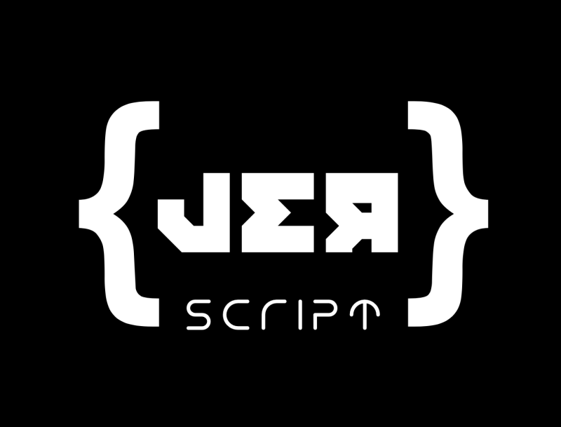

[](https://github.com/JERScript/JERscript)

[](https://github.com/JERScript/JERscript)
[](https://github.com/JERScript/JERscript/issues)
[](https://github.com/JERScript/JERscript/pulls)
[](https://github.com/JERScript/JERscript/blob/master/LICENSE)
[](https://github.com/JERScript/JERscript/stargazers)
[](https://github.com/jerbear2008/JERscript/releases)
[](https://discord.gg/gCGmraBRQ8)

# JERscript
A [scripting language](https://www.google.com/search?q=scripting+language) inspired by [Lua](https://github.com/lua/lua)'s simplicity and [Python](https://www.python.org/) syntax completely made in [Javascript](https://nodejs.org/en/), with [Moo](https://www.npmjs.com/package/moo) and [Nearley](https://www.npmjs.com/package/nearley)!

Feel free to contribute, make sure to star, fork and watch!

## License
MIT

## Roadmap
- Object Oriented Programming
- Arrays
- If/elseif/else statements
- For/while
- Functions
- Proper JS generation

## Chat
You can ask for help, chat or generally hang out in our [Discord server](https://discord.gg/gCGmraBRQ8)!

## Usage/Examples

```
// Fibonacci Sequence

fib-(n)->{
    // Initalize the functions

    // A returns one, as the final statement in a lambda function is always a return
    a-()->1
    // If statement to check if N is equal to 2, go to A otherwise go to C
    b-()-> {
        if (eq(n 2) a c)
    }
    c-()->{
        evaluate(fib(evaluate(n 1 "-")) fib(evaluate(n 2 "-")) "+")
    }

    // Initalize the main statement
    if (eq(n 1) a b)
}
fib(10)
```

# FAQ
### What does JER stand for?
It stands for: Julian, Eclipse, Rehan (or RStar, depending on what they think)

### Why Javascript?
We chose Javascript because of the 3 main reasons:
- We aren't good with C, C++, Java, or any compiled language for that matter (except for eclipse with C#).
- We are all good with Javascript and Node.js, we know the language pretty well or had a master's degree on it.
- Even if we did choose a compiled language (ex. C++), we'd still suck at it because we can't compile to multiple platforms. (We can, it's just that we don't know how.)

### Why Python/Lua?
At first, Eclipse loved the idea of Lua's simplicity and C++. Julian didn't really like how we were making a scripting language based of off Lua. We argued for a bit and eventually landed with Lua's simplicity and Python's syntax.
